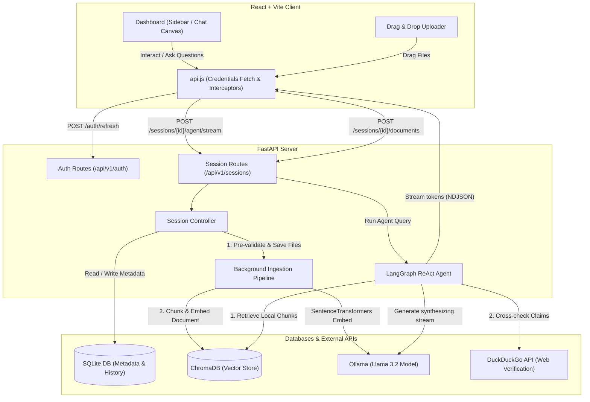

# Lumen AI — Premium RAG Engine & Chat Interface

Lumen AI is a premium, self-hosted Retrieval-Augmented Generation (RAG) document analysis engine and chat application. It combines a robust **FastAPI backend** running a **LangGraph ReAct agent** (with local document retrieval and live DuckDuckGo web verification) and a modern **React + Vite frontend** overhauled with a minimalist ChatGPT-like dark theme.

---

## Architecture & Data Flow

Below is the architecture diagram showing how the frontend, FastAPI controllers, SQLite metadata DB, ChromaDB vector store, LangGraph agent, Ollama model, and web tools interact:



---

## Core Features

### 1. Robust RAG Agent (LangGraph ReAct)
* **Local Ingestion:** Uploads `pdf`, `docx`, `txt`, `md`, and `csv` files.
* **Background Embeddings:** Files are automatically parsed and embedded in the background using `sentence-transformers/all-MiniLM-L6-v2` and indexed in session-isolated ChromaDB collections.
* **Self-Verifying Web Verification:** The agent follows a two-step reasoning process:
  1. Retrieve relevant local passages from your files.
  2. Query the web (DuckDuckGo) to verify, update, or expand on local findings.
* **Reasoning Logs:** Renders real-time reasoning steps showing the agent's logic (e.g. searching local store, calling Wikipedia, or querying the calculator).

### 2. High-Fidelity Streaming UI
* **ChatGPT Dark Aesthetics:** Built on a clean, bubble-less Zinc dark theme with custom emerald green accents.
* **Global Drag-and-Drop:** Drag and drop files anywhere over the screen to trigger a blurred upload animation and automatically ingest documents.
* **Inline Citations:** AI responses render citation link tags containing source types (local file vs. web link), original filenames, and page indicators.
* **Markdown Support:** Full compilation of headings, lists, bold text, inline code, and fenced code blocks using `marked`.

### 3. Authentication & Security
* **JWT Cookie Authentication:** Utilizes HTTP-only cookies (`access_token` and `refresh_token`) to secure session routes.
* **Silent Token Renewal:** Frontend features a request interceptor queue. If the access token expires (401 response), the client silently queries `/auth/refresh` to renew cookies and retries the original request seamlessly.
* **Transactional Integrity:** Validation fails early if uploaded files are corrupt or of unsupported formats. In case of any server failures, partially uploaded files and metadata are rolled back and deleted.

---

## Directory Structure

```
Lumen/
├── backend/
│   ├── src/
│   │   ├── config/          # Environment settings
│   │   ├── controllers/     # Controller business logic
│   │   ├── database/        # SQLite database connection
│   │   ├── models/          # SQLAlchemy models
│   │   ├── rag/             # LangGraph agent, loaders, splitter, vector store
│   │   ├── routes/          # API Route configurations
│   │   ├── schemas/         # Pydantic schemas
│   │   └── utils/           # Helper files
│   ├── pyproject.toml
│   └── main.py              # Backend entry point
└── frontend/
    ├── src/
    │   ├── assets/          # Icons & SVG graphics
    │   ├── components/      # Sidebar, ChatArea, MessageInput, Auth, Dashboard
    │   ├── api.js           # API Client wrapper
    │   └── index.css        # Global CSS variables & Markdown theme
    ├── package.json
    └── vite.config.js       # Vite configuration (Tailwind v4)
```

---

## Setup & Running Locally

### Backend Setup

1. **Prerequisites:** Python 3.12, [Ollama](https://ollama.com/) installed and running.
2. **Download Model:**
   ```bash
   ollama pull llama3.2
   ```
3. **Environment Setup:** Go to the `backend` directory and create a `.env` file:
   ```bash
   cd backend
   ```
   Create a `.env` file containing:
   ```env
   ACCESS_TOKEN_SECRET="YourSecret"
   REFRESH_TOKEN_SECRET="YourSecret"
   is_development=True
   ```
4. **Install Dependencies & Start Backend:**
   Using `uv`:
   ```bash
   uv run python main.py
   ```
   Or standard pip venv:
   ```bash
   python -m venv .venv
   source .venv/bin/activate  # Or .venv\Scripts\activate on Windows
   pip install -r requirements.txt
   python main.py
   ```
   The backend will start on `http://localhost:8000`.

### Frontend Setup

1. **Prerequisites:** Node.js (v18+) and npm.
2. **Install & Run:**
   ```bash
   cd ../frontend
   npm install
   npm run dev
   ```
3. Open `http://localhost:5173` in your browser.

---

## API Endpoint Reference

| Method | Route | Description | Auth Required |
|---|---|---|---|
| `POST` | `/api/v1/auth/register` | Register a new user | No |
| `POST` | `/api/v1/auth/login` | Log in and receive HTTP-only cookies | No |
| `POST` | `/api/v1/auth/refresh` | Renew expired access tokens silently | No |
| `POST` | `/api/v1/auth/logout` | Revoke active cookies and logout | Yes |
| `GET` | `/api/v1/auth/me` | Fetch active user credentials | Yes |
| `POST` | `/api/v1/sessions/` | Create a new chat session | Yes |
| `GET` | `/api/v1/sessions/` | List all sessions for logged-in user | Yes |
| `DELETE` | `/api/v1/sessions/{id}` | Delete a session and its vector store | Yes |
| `POST` | `/api/v1/sessions/{id}/documents` | Upload files and queue embeddings | Yes |
| `GET` | `/api/v1/sessions/{id}/documents` | Poll status of uploaded files | Yes |
| `POST` | `/api/v1/sessions/{id}/agent/stream` | Stream agent responses & tool logs (NDJSON) | Yes |
| `GET` | `/api/v1/sessions/{id}/messages` | Fetch paginated chat messages history | Yes |
